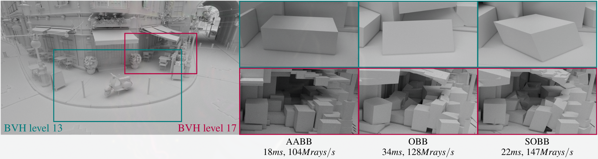

# SOBB BVH
This is a reference implementation of [SOBB: Skewed Oriented Bounding Boxes for Ray Tracing](https://doi.org/10.1111/cgf.70062) by M. Káčerik and J. Bittner.

## Build
### Requirements (tested versions)
* Linux (both x11 and wayland) or Windows 11
* C++ compiler (gcc v15.2.1, clang v20.1.8, msvc v14.44)
* CMake (v4.1.2, minimal v3.21)
* Vulkan (v1.4.321, minimal v1.3)
* NVIDIA GPU (3080Ti)
* AMD GPU (9070XT RADV/Adrenaline) experimental: gpu workloads are not optimized, stats gathering does not work with Adrenaline (win32)

### CMake with default build tools
```
git clone --recurse-submodules https://github.com/kachnicka/sobb.git
cd sobb
cmake -B build
cmake --build build --config Release -j 16
cmake --install build
cd install
./sobb [or sobb.exe]
```
Optionally, CMake presets for all tested platforms are included.

## Usage
### Configuration
Algorithm parameters are defined in [benchmark.toml](data/benchmark.toml). Scenes are defined in [scene.toml](data/scene.toml) and can be supplied by the user. Application can serialize loaded scene to a custom binary format for fast load.

### Navigation and camera views
Blender style: middle-mouse-button for rotation, mouse-wheel for zoom, shift + middle-mouse-button for panning. Camera views can be saved and restored between the application runs.

### Path Tracing compute
For each BVH, three outputs are available: path traced, BVH levels explorer, and a heat map, indicating the number of computed intersections (for primary rays by default).

#### Important algorithms:
1. [SOBB BVH construction](data/shaders/final/transform_aabb_sobb.glsl) by parallel bottom-up refit of AABB BVH.
2. [SOBB](data/shaders/final/shared/bv_sobb.glsl) surface area, k-DOP exploration strategies.
3. [Generic BVH2 traversal](data/shaders/final/ptrace_bvh2.comp) specialized for all tested BVs. 
4. [Intersection tests](data/shaders/final/shared/intersection.glsl#L236) for SOBBs (and other BVs).

On the host side, BVH construction is directed from [BvhBuilder.h](src/sobb/backend/vulkan/workload/bvh/BvhBuilder.h).
